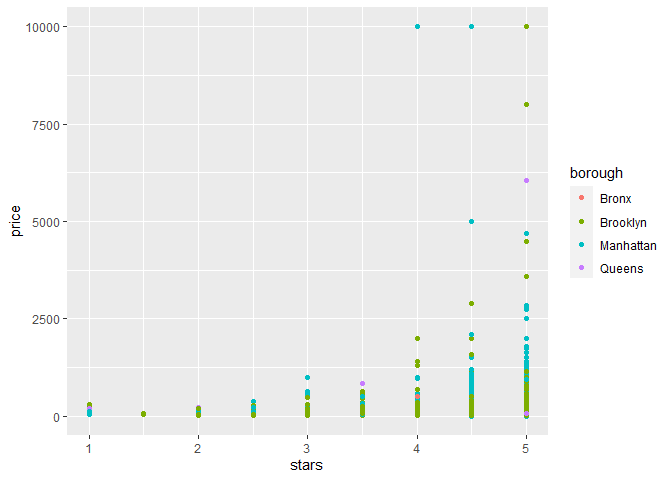

Linear Models
================

``` r
library(tidyverse)
```

    ## ── Attaching core tidyverse packages ──────────────────────── tidyverse 2.0.0 ──
    ## ✔ dplyr     1.1.3     ✔ readr     2.1.4
    ## ✔ forcats   1.0.0     ✔ stringr   1.5.0
    ## ✔ ggplot2   3.4.3     ✔ tibble    3.2.1
    ## ✔ lubridate 1.9.2     ✔ tidyr     1.3.0
    ## ✔ purrr     1.0.2     
    ## ── Conflicts ────────────────────────────────────────── tidyverse_conflicts() ──
    ## ✖ dplyr::filter() masks stats::filter()
    ## ✖ dplyr::lag()    masks stats::lag()
    ## ℹ Use the conflicted package (<http://conflicted.r-lib.org/>) to force all conflicts to become errors

``` r
library(p8105.datasets)
```

``` r
data("nyc_airbnb") 

nyc_airbnb <-
  nyc_airbnb |>
  mutate(stars = review_scores_location / 2) |>
  rename(
    borough = neighbourhood_group,
    neighborhood = neighbourhood) |>
  filter(borough != "Staten Island") |>
  select(price, stars, borough, neighborhood, room_type)
```

``` r
nyc_airbnb |>
  ggplot(aes(x = stars, y = price, color = borough)) +
  geom_point()
```

    ## Warning: Removed 9962 rows containing missing values (`geom_point()`).

<!-- -->

Look at the model we care about

``` r
fit = lm(price ~ stars + borough, data = nyc_airbnb)
```

Let’s look at the result…

Lets look at the result bettter…

``` r
broom::glance(fit)
```

    ## # A tibble: 1 × 12
    ##   r.squared adj.r.squared sigma statistic   p.value    df   logLik    AIC    BIC
    ##       <dbl>         <dbl> <dbl>     <dbl>     <dbl> <dbl>    <dbl>  <dbl>  <dbl>
    ## 1    0.0342        0.0341  182.      271. 6.73e-229     4 -202113. 4.04e5 4.04e5
    ## # ℹ 3 more variables: deviance <dbl>, df.residual <int>, nobs <int>

``` r
broom::tidy(fit) |>
  select(-std.error, -statistic) |>
    mutate(
      term = str_replace(term, "borough", "Borough: ")
    ) |>
    knitr::kable(digits = 3)
```

| term               | estimate | p.value |
|:-------------------|---------:|--------:|
| (Intercept)        |  -70.414 |   0.000 |
| stars              |   31.990 |   0.000 |
| Borough: Brooklyn  |   40.500 |   0.000 |
| Borough: Manhattan |   90.254 |   0.000 |
| Borough: Queens    |   13.206 |   0.145 |
